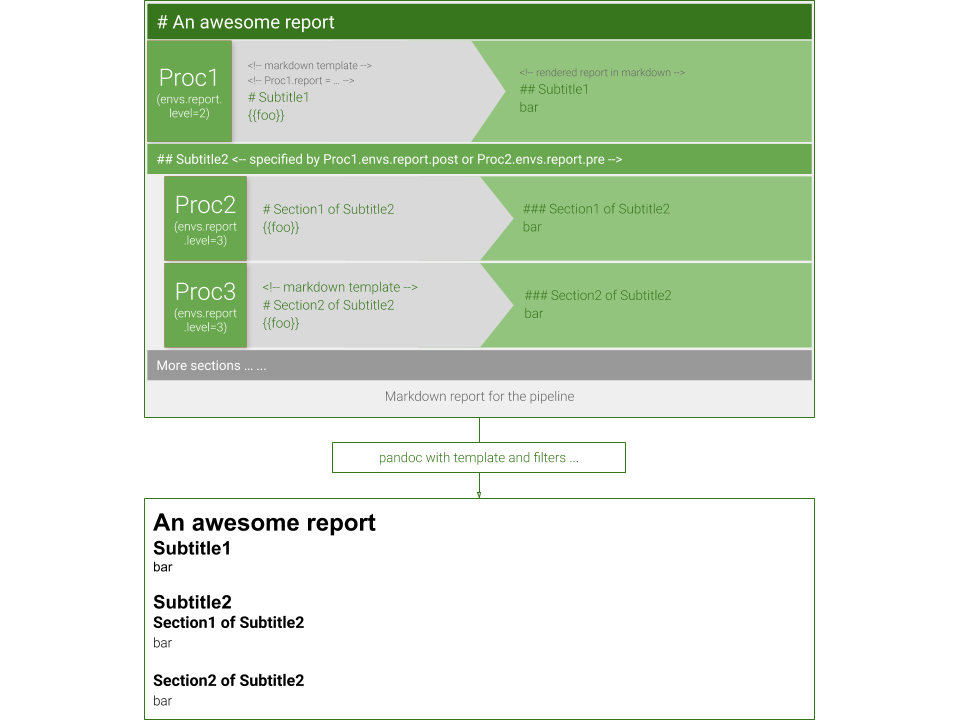

# pyppl_report

[![Pypi][3]][4] [![Github][5]][6] [![PyPPL][7]][1] [![PythonVers][8]][4] [![Travis building][10]][11] [![Codacy][12]][13] [![Codacy coverage][14]][13]

A report generating system for [PyPPL][1]

## Installation
Requires pandoc 2.7+ (and wkhtmltopdf 0.12.4+ when creating PDF reports)

`pyppl_report` requires `pandoc/wkhtmltopdf` to be installed in `$PATH`

```shell
pip install pyppl_report
```

## Usage
### Specifiation of template

````python
pPyClone.config.report_template = """
# {{report.title}}

PyClone[1] is a tool using Probabilistic model for inferring clonal population
structure from deep NGS sequencing.

}})

```table
caption: Clusters
file: "{{path.join(job.o.outdir, "tables/cluster.tsv")}}"
rows: 10
```

[1]: Roth, Andrew, et al. "PyClone: statistical inference of clonal population structure in cancer."
Nature methods 11.4 (2014): 396.
"""

# or use a template file

pPyClone.config.report_template = "file:/path/to/template.md"
````

### Generating report
```python
PyPPL().start(pPyClone).run().report(
	'/path/to/report',
	title='Clonality analysis using PyClone',
	template='bootstrap'
)

# or save report in a directory
PyPPL(name='Awesome-pipeline').start(pPyClone).run().report('/path/to/')
# report generated at ./Awesome-pipeline.report.html
```

Command line tool:
```shell
> pyppl report
Description:
  Convert a Markdown file to report.

Usage:
  pyppl report --in <LIST> [OPTIONS]

Required options:
  -i, --in <LIST>           - The input file.

Optional options:
  -o, --out <AUTO>          - The output file. Default: <in>.html
  -n, --nonstand [BOOL]     - Non-standalone mode. Save static files in  <filename of --out>.files  separately. \
                              Default: False
      --filter <LIST>       - The filters for pandoc Default: []
      --toc <INT>           - The depth of heading levels to put in TOC. 0 to disable. Default: 3
      --title <STR>         - The title of the document.
                              If the first element of the document is H1 (#), this will be ignored \
                              and the text of H1 will be used as title.
                              If the title is specified as "# Title", then a title will be added \
                              anyway. Default: Untitled document
      --template <STR>      - The template to use. Either standard template name or full path to \
                              template file. Default: bootstrap
  -h, -H, --help            - Show help message and exit.
```


### Extra data for rendering
You can generate a `toml` file named `job.report.data.toml` under `<job.outdir>` with extra data to render the report template. Beyond that, `proc` attributes and `args` can also be used.

For example:
`job.report.data.toml`:
```toml
description = 'A awesome report for job 1'
```
Then in your template, you can use it:
```markdown
## {{jobs[0].description}}
```

## Built-in templates

Check them to see features those templates support:

- [Layui](https://pwwang.github.io/pyppl_report/layui.html)
- [Bootstrip](https://pwwang.github.io/pyppl_report/bootstrap.html)
- [Semantic](https://pwwang.github.io/pyppl_report/semantic.html)


## How does it work?

Following figure demonstrates how the plugin works:



Each process that you want to report, will need to have a template assigned with `pXXX.config.report_template`. Like scripts, you may prefice it with `file:`, and then followed by an absolute path to the template or a relative one to where it's assigned. You may even assign a template using a direct string. A process with no template assign will be hidden from the report.

You can use the data from the jobs or the process to render the template.

The report for each process will then be assembled by the plugin, and converted using pandoc with a default template and some built-in filters. Finally, your report will be a standalone html file.

For larget reports, `non-standaone` reports are recommended: `.report(standalone=False, ...)`

## Environments

You may pass values to process envs to control report content:
```python
pXXX.config.report_envs.foo = "bar"
```
Then in you can use it in the report template:
```python
pXXX.config.report_template = """
The value of foo is "{{foo}}".
"""
```

### Preserved envs variables

We have 4 preserved variables under `pXXX.envs`:
```python
# Control the level of headings in the
pXXX.config.report_envs.level = 1
# Content to add before the template
pXXX.config.report_envs.pre = ''
# Content to add after the template
pXXX.config.report_envs.post = ''
# The title of the process report
pXXX.config.report_envs.title = None
```

#### Process report levels

No matter at which level you want to put this process report in the entire report, you need to each heading from level 1, then according to `pXXX.config.report_envs.level`, the headings will be shifted to corresponding level. For example, with `pXXX.config.report_envs.level = 2`, following template

```markdown
# Section
## Subsection
content
```

will be rendered into:
```markdown
## Section
### Subsection
content
```

It will not affect comments in code blocks such as:
````
```
## some comments
```
````

#### Adding extra contents to process report

You may add extra contents to the process report. For example, if you put the process report at level 2, then you probably need a level-1 heading. For previous example, if you have `pXXX.config.report_envs.level = 2`, without a level-2 heading, the entire report will look like:

```markdown
## Section
### Subsection
content
```

Then you missed a level-1 heading, which will make your report look wired. Here you can specify a level-1 heading with `pXXX.config.report_envs.pre = '# I am H1'`:

```markdown
# I am H2
## Section
### Subsection
content
```

You may also append something to the process report with `pXXX.config.report_envs.post`

Headings added by `pre` and `post` will **NOT** be adjusted by `pXXX.config.report_envs.level`

#### Title of the process report

By default, if not assigned or assigned with `None`, the process description will be used as the title of the process report. Of course you can overwrite it with `pXXX.config.report_envs.title`.

```python
# by default
pXXX = Proc(desc = 'Some analysis')
# ... other necessary settings
pXXX.report = '# {{report.title}}'
```

will be rendered as:
```markdown
# Some analysis
```

with `pXXX.config.report_envs.title = 'An amazing analysis'`, we will have:

```markdown
# An amazing analysis
```

### Making your report flexiable

You can interpolate some variables in the templates to make your report flexiable. For example, you may want to hide an image in some cases:

```markdown
# {{report title}}

I have enough details.




```

Then you can show that image in the report only when you have `pXXX.config.report_envs.showimage = True`.

## Change log

[Change log](./docs/CHANGELOG.md)

[1]: https://github.com/pwwang/PyPPL
[2]: https://pyppl_report.readthedocs.io/en/latest/
[3]: https://img.shields.io/pypi/v/pyppl_report?style=flat-square
[4]: https://pypi.org/project/pyppl_report/
[5]: https://img.shields.io/github/tag/pwwang/pyppl_report?style=flat-square
[6]: https://github.com/pwwang/pyppl_report
[7]: https://img.shields.io/github/tag/pwwang/pyppl?label=PyPPL&style=flat-square
[8]: https://img.shields.io/pypi/pyversions/pyppl_report?style=flat-square
[9]: https://img.shields.io/readthedocs/pyppl_report.svg?style=flat-square
[10]: https://img.shields.io/travis/pwwang/pyppl_report?style=flat-square
[11]: https://travis-ci.org/pwwang/pyppl_report
[12]: https://img.shields.io/codacy/grade/2b7914a18f794248a62d7b36eb2408a3?style=flat-square
[13]: https://app.codacy.com/manual/pwwang/pyppl_report/dashboard
[14]: https://img.shields.io/codacy/coverage/2b7914a18f794248a62d7b36eb2408a3?style=flat-square
