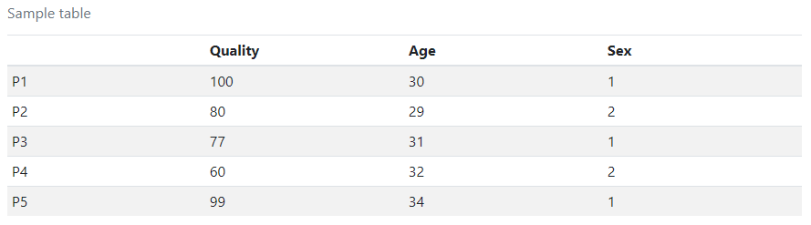
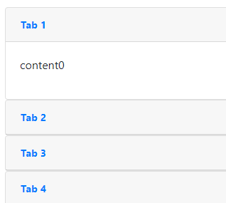

We have some built-in `pandoc` filters, togeter with some javascripts in the default template, which makes some complex HTML components available.

## Table from file

Syntax:

````markdown
```table
caption    : An awesome table
file       : ../tests/filetable.txt
header     : true
width      : 1
total_width: .8
align      : default
rows       : 10
cols       : 0
csvargs    :
  dialect: unix
  delimiter: "\t"
```
````



- You can have individual width for each column:
	```yaml
	width:
		- .2
		- .4
		- .2
	```
- As well as alignment:
	```yaml
	align:
		- left
		- center
		- right
	```
- You can show part of the table with `rows` and `cols`. `0` means to show all the rows or columns.
- See `csv.reader` for `csvargs` from [`csv`](https://docs.python.org/3/library/csv.html) module.

## Tabs and collapses

Sometimes, when there are too many sections and you want to keep the title in the same screen, you probably need to use tabs or collapse. A simple example is as below:

```markdown
# {{title}}


::: {.tab}
content{{i}}
:::

'''
```

Where there are no more than 3 `::: {.tab}`, then they will be rendered as tabs (actually implemented by javascript):


Otherwise, it will be collapses:



To specify the names of the tabs or collapses, you need `h3/h4/h5` in the div, depending on the up level of the headings. For example:
```markdown
# {{title}}


::: {.tab}
## Section{{i}}
content{{i}}
:::

'''
```

!!! note

	Headings in `::: {.tab}` used as tab/collapse names will also be adjusted by `envs.report.level`

!!! hint

	A set of tabs or collapses can be embedded in a tab or a collapse.

!!! hint

	You can also force them into collapses when there are no more than 3 or force them into tabs otherwise. To force a set of `::: {.tab}` into tabs, you need to add one more class to the `DIV`:

	- For tabs: `::: {.tab .force-tab}`
	- For collapses: `::: {.tab .force-collapse}`

## Modal

A modal is like a popup box inside the page. You can put anything in a modal.

Syntax:

```markdown
# Title
Click [here](modal#detailinfo) for details.

::: {.modal id="detailinfo" title="Detailed information" closebtn="true" size="xlarge"}
Anything you want to put in the modal

You may also put tables, images, tabs and collpases in here
:::
```

The link to popup the modal has to be with URL like `modal#<id>`. `closebtn` is controlling whether to show a close button on the bottom of the modal. For modal size, see below:

|Size|Alias|Modal max-width|
|-|-|-|
|small|sm|300px|
|default|-|500px|
|large|lg|800px|
|xlarge|xl|1140px|

## Citations

You can put citations like markdown link shortcuts:
```markdown
A paper[1] mentioned, ...

[1]: The paper
```

You can have citations for each process, finally they will be re-ordered and merged if some processes share same references (you have to have extractly the same refereces for different processes, lik `The paper` here.

!!! warning

	You have to use inline links `[text](link)` instead of `[text][1]` for real links.

## Appendix

One report will only have one appendix, so the appendix content from all processes will be combined. To claim an appendix section in the template, you have to use level-2 heading:
```markdown
## Appendix
### Section1
...
```

!!! warning

	- Appendix should be claimed exactly using `## Appendix`, which will NOT be adjusted by `envs.report.level`.
	- Any headings claimed after it will not be adjusted by `envs.report.level`, either. So it should be put at the end of the template

